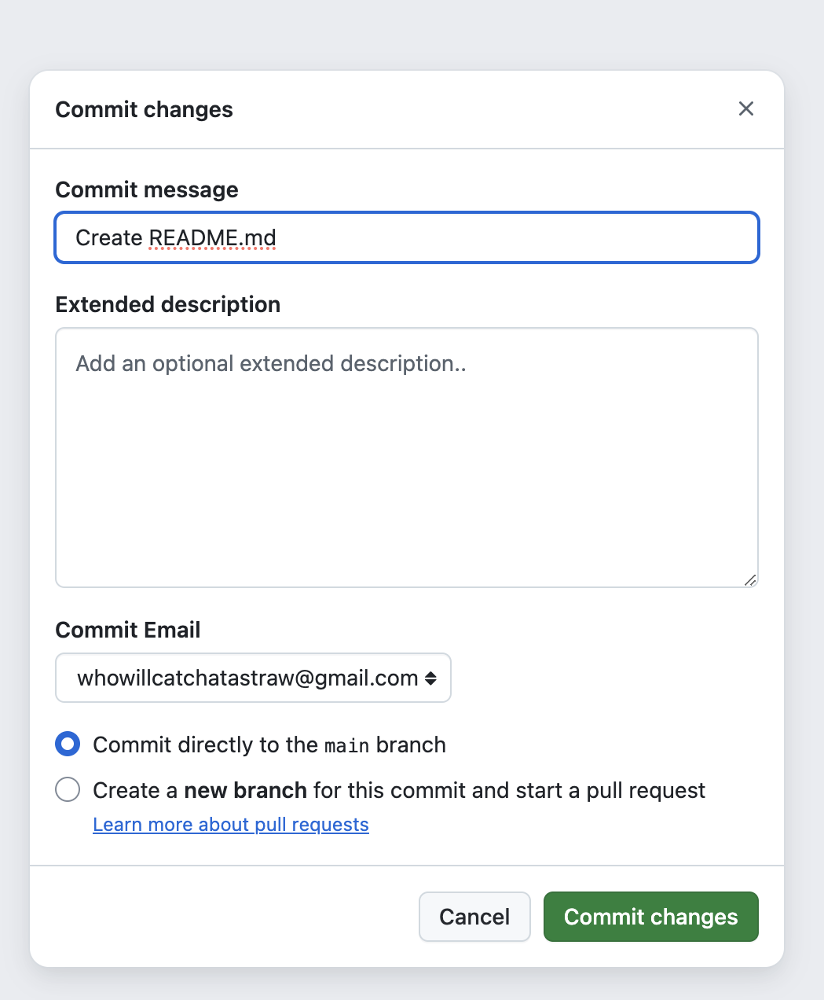

# これだけはできてほしいGitとGitHub
## はじめに
これができればチーム開発に参加できます！\
最低限のGitとGitHubの使い方を学ぶことができます．私が普段使うコマンドをまとめて説明します．
基本的に，コピペで実行できます．エラーがあればissueに書いてください．

## 目次
1. クローン
2. git管理
3. sshでのGitHub
4. GitHubへ保存する
5. 変更をGitHubへ反映する
6. 他の人の変更を取り込む
7. ブランチを使って開発する
8. gitignore

## 環境
- Host: MacBook Pro 14 inch
- OS: macOS Sequoia 15.1
- Shell: zsh 5.9

linuxでも同様にできます．Windowsの場合はGit Bashを使ってください．
Git Bashのインストール方法は次の記事を参考にしてください．
[WindowsにGit Bashをインストールする](https://qiita.com/suke_masa/items/404f06309bb32ca6c9c5)

## 1. クローン
### 1-1. リポジトリのクローン
これができれば天才の開発したコードを使うことができます．\
まずは，このリポジトリをクローンしてみましょう．
以下のコマンドをターミナルに入力してください．

```zsh
git clone https://github.com/tomoswifty/learn-git-for-code-management.git
```

すると，今いる場所に`learn-git-for-code-management`というフォルダが追加されています．

### 1-2. ブランチを指定してクローン
公開されているコードには，ブランチで分けられている場合があり自分の環境に合わせたバージョンのコードになっている必要があります．\
そこで，複数のバージョンを公開する場合によく用いられる方法として複数のブランチが公開されています．

```zsh
git clone -b ブランチ名 https://github.com/tomoswifty/learn-git-for-code-management.git
```

これで，指定したブランチのリポジトリをクローンできます．先ほどのmainブランチではなく，`feature-branch`ブランチが追加されています．

特にこのリポジトリは必要ありませんので，削除して構いません．

## 2. git管理
### 2-1. ファイルの作成
まずはgit管理したいファイルを作成します．
`learn-git`というフォルダを作成して，その中に`test.txt`というファイルを作成しましょう．

```zsh
mkdir learn-git
cd learn-git/
touch test.txt
```
`text.txt`に`Hello, World!`と記入しましょう．

```zsh
nano test.txt
```
#### nanoエディタの使い方
`ctrl + x`→`y`→`Enter`で保存して終了です．

<div style="display: flex; justify-content: space-between;">
    
    
    
</div>


> [!NOTE]
> nanoが使えない場合
> `nano`が使えない場合はインストールしましょう．
> ```zsh
> brew install nano
> ```
> もしくは`vim`など他のエディタを使ってください．

ここで，ファイルを確認しましょう．
```zsh
ls -a
```

このように表示されているはずです．
```zsh
$ ls -a
.		..		test.txt
```

次にファイルの中身を変更しましょう．
```zsh
cat test.txt
```
このように表示されていれば成功です．
```zsh
Hello, World!
```

### 2-2. git管理に追加
```zsh
git init
```
これでgit管理されます．
以下のように表示されれば成功です．
```zsh
$ git init
Initialized empty Git repository in /Users/{YOUR USERNAME}/learn-git/.git/
```

### 2-3. 変更のステージ
コミット前に必要なおまじないです．
```zsh
git add -A
```

### 2-4. 変更をコミット

```zsh
git commit -m "first commit"
```
これがコミットです．
変更が保存されます．
## 3. sshでのGitHub
sshでGitHubにアクセスする方法を紹介します．
### 3-1. sshキーを生成
```zsh
cd .ssh
```
このとき，`.ssh`がなければ作成します．
```zsh
mkdir .ssh
```
ssh鍵を生成します．
```zsh
ssh-keygen -t rsa 
```
作成できたか確認します．
```zsh
ls -a
```
このように,`id_rsa`と`id_rsa.pub`が表示されていれば成功です．
```zsh
$ ls -a
.		id_rsa
..		id_rsa.pub
```

公開鍵を確認します．

```zsh
cat id_rsa.pub
```
この中身をコピーします．

### 3-2. GitHubにsshキーを登録
GitHubにsshキーを登録します．

GitHubにログインし，右上のアイコンから「Settings」を選択します．


左のメニューから「SSH and GPG keys」を選択します．


「New SSH key」をクリックします．


「Title」に任意の名前を入力し，「Key」に先ほどコピーした公開鍵を貼り付けます．

「Add SSH key」をクリックして登録完了です．


これで，sshキーの登録は完了です．


## 4. GitHubへ保存する
### 4-1. GitHubにリポジトリを作成
GitHubにリポジトリを作成します．\
ブラウザからGitHubにアクセスしてサインインします．
この画像のように，緑色の「Create repository」ボタンをクリックしてリポジトリを作成します．


リポジトリ名は「learn-git」とします．
「Public」を選択し，「Add a README file」のチェックは外します．


作成したら，以下のような画面が表示されます．


ここのQuick setupのSSHをクリックします．
以下のような画面が表示されます．
前章で作成したsshキーを使ってこのリポジトリにアクセスします．


この画像にあるコマンドを次章で実行します．

### 4-2. remoteにリポジトリを追加
ターミナルへ戻ります．

commitまでは完了していますので，次はリモートリポジトリを追加します．
その前に，おまじないです．
```zsh
git branch -M main
```
これは，ブランチ名をmainに変更するコマンドで，昔はmasterという名前でした．転換期に必要なコマンドでしたが最新版のgitではデフォルトでmainになっているので不要ですが，念のため実行しておきます．

そして，リモートリポジトリを追加します．
```zsh
git remote add origin git@github.com:YOUR_GITHUB_USERNAME/learn-git.git
```
ここで，`git@github.com:YOUR_GITHUB_USERNAME/learn-git.git`の部分は，先ほどGitHubで作成した自身のリポジトリのURLに変更してください．

### 4-3. GitHubへpush
```zsh
git push -u origin main
```
これでGitHubへpushできました．
```zsh
$ git push -u origin main                                      
Enumerating objects: 3, done.
Counting objects: 100% (3/3), done.
Writing objects: 100% (3/3), 228 bytes | 228.00 KiB/s, done.
Total 3 (delta 0), reused 0 (delta 0), pack-reused 0
To github.com:YOUR_GITHUB_USERNAM/learn-git.git
 * [new branch]      main -> main
branch 'main' set up to track 'origin/main'.
```

GitHubのページをリロードして，リポジトリが更新されていることを確認してみましょう．


## 5. 変更をGitHubへ反映する
### 5-1. ファイルを変更する
```zsh
nano test.txt
```

### 5-2. ローカルでコミットする
```zsh
git add -u
git commit -m "add a comment"
```

### 5-3. GitHubへpush
```zsh
git push -u origin main
```
4章と同様に，GitHubのページをリロードして，リポジトリが更新されていることを確認してみましょう．
変更が反映されていれば成功です．
コミットメッセージも変更されているはずです．

## 6. 他の人の変更を取り込む
### 6-1. ファイルの変更
GitHubのページで変更を加えます．\
GitHubのページで「Add a README」をクリックします．


タイトルを記入して「Commit changes」をクリックします


コミットメッセージを確認して，「Commit」をクリックします．
<div style="display: flex; justify-content: space-between;">
    
</div>

これで，GitHub上で変更が加えられました．


### 6-2. ローカルへpull
```zsh
git pull origin main
```

```zsh
$ ls
README.md	test.txt
```
となって変更を取り込むことができました．

## 7. ブランチを使って開発する
### 7-1. ブランチを作成する
```zsh
git branch dev
``` 
### 7-2. ブランチをpushする
```zsh
git push origin dev
```

## 8. gitignore
いらないファイルをgit管理から除外することができます．

git管理から外すファイルを作成してみます．
```zsh
touch dummyfile.txt
```

macOSでは`.DS_Store`がたびたび作成されます．
わざわざpushする必要はないので，`.gitignore`に追加しましょう．
```zsh
nano .gitignore
```
```.gitignore
.DS_Store
dummyfile.txt
```
これでpushしてみましょう．
すると，リモートリポジトリにはdummyfile.txtが反映されていないはずです．


# おわりに
これでひととおりGitとGitHubを使うことができるようになったと思います．\
しかし，まだまだgitを使いこなすには知識が足りません．本来の機能であるrevertやPull Request，issueなどを使うことでよりgitを使いこなすことができます．\
もっと学びたい方は参考文献をご覧ください．

# 参考文献
- [GitHubでssh接続する手順~公開鍵・秘密鍵の生成から~](https://qiita.com/shizuma/items/2b2f873a0034839e47ce)

- [[Git]これだけ押さえる！gitconfigの基本](https://qiita.com/C_HERO/items/c35e679f0b03a5f06469)
